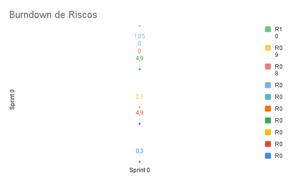

# Planejamento da Sprint 0

**Número da _Sprint_:** 0

**Data de Início:** 14/08/2021  

**Data de Término:** 23/08/2021

**Duração:** Nove dias

**Pontos Planejados**: 35

**Pontos Adicionados**: 0

**Pontos Totais**: 35

-------

[1. Pareamento](#1-pareamento)

[2. Priorização](#2-priorizacao)

[3. Burndown de Riscos](#4-burndown-de-riscos)

[4. Features da _Sprint_](#5-features-da-sprint)

-------
## 1. Pareamento
Nesta sprint, por não ter desenvolvimento de código, o time optou por trabalhar juntos para elaborar a documentação necessária.

## 2. Priorização
A priorização das histórias foi feita na necessidade de definir e consolidar a visão do produto entre os _stackholders_.

## 3. Burndown de Riscos

A  tabela a seguir lista todos os riscos que foram identificados para essa _Sprint_, a probabilidade deles ocorrerem, quantos dias serão perdidos caso o risco ocorra e a exposição ao risco. A probabilidade do risco é dividida em:
    * Nenhuma = 0%;
    * Muita baixa = 15%;
    * Baixa = 30%;
    * Média = 50%;
    * Alta = 70%;
    * Vai ocorrer = 100%.

Já a exposição é calculada multiplicando a probabilidade do risco pelo tamanho da perda.

| #  | Descrição | Probabilidade do Risco |Tamanho da Perda (dias)|Exposição ao Risco |
| :- | :---------------                                         | :---| :-| :--- |
| 01 | Incompatibilidade de horários para reuniões              | 30% | 1 | 0,3  |
| 02 | Features mal pontuadas                                   | 70% | 7 | 4,9  |
| 03 | Baixa produtividade                                      | 30% | 7 | 2,1  |
| 04 | Mais pontos planejados do que o time é capaz de entregar | 70% | 7 | 4,9  |
| 05 | Dificuldades com a tecnologia de desenvolvimento         | 0%  | 3 | 0    |
| 06 | Erros na implementação de Features                       | 0%  | 7 | 0    |
| 07 | Features mal documentadas                                | 15% | 7 | 1,05 |
| 08 | Quebra ou furto de equipamentos da equipe                | 15% | 7 | 1,05 |
| 09 | Desistência de algum membro                              | 30% | 7 | 2,1  |
| 10 | Problemas na configuração do ambiente de desenvolvimento | 70% | 2 | 1,4  |
|    |   |   | Exposição:  | 17,8 |

Abaixo é mostrado o _Burndown_ de riscos das _Sprints_ em que foi em que ele foi levantado.

## 4. Features da _Sprint_
* <a href="https://github.com/lucaaas/Equipe8DS/issues/23"> [#23]Eu, como desenvolvedor, gostaria de desenhar um diagrama de classes para orientar o desenvolvimento </a>
* <a href="https://github.com/lucaaas/Equipe8DS/issues/24"> [#24]Eu, como desenvolvedor, gostaria de configurar um ambiente de desenvolvimento para a execução do projeto </a>
* <a href="https://github.com/lucaaas/Equipe8DS/issues/25"> [#25]Eu, como desenvolvedor, gostaria de escrever um documento de visão para melhorar consolidar a visão do projeto </a>
* <a href="https://github.com/lucaaas/Equipe8DS/issues/26"> [#26]Eu, como Scrum Master, gostaria de manter um quadro de conhecimento para acompanhar o domínio dos membros nas tecnologias usadas </a>
* <a href="https://github.com/lucaaas/Equipe8DS/issues/27"> [#27]Eu, como Scrum Master, gostaria de manter um burndown de risco para ter um controle melhor dos riscos do projeto </a>