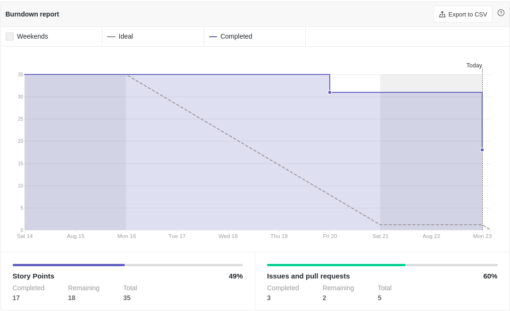

# Resultados da Sprint 0
------

[1. Indicadores de Qualidade do Processo](#1-indicadores-de-qualidade-do-processo)

- [# Resultados da Sprint 0](#-resultados-da-sprint-0)
- [1. Indicadores de Qualidade do Processo](#1-indicadores-de-qualidade-do-processo)
  - [1.1 Fechamento da _Sprint_](#11-fechamento-da-sprint)
  - [1.2 _Burndown_](#12-burndown)
  - [1.3 Gráfico de _commits_](#13-gráfico-de-commits)
  - [1.4 _Velocity_](#14-velocity)
  - [1.5 Quadro de Conhecimento](#15-quadro-de-conhecimento)
  - [1.6 Revisão da _Sprint_](#16-revisão-da-sprint)
  - [1.7 Retrospectiva](#17-retrospectiva)
  - [1.7.1 Pontos Positivos](#171-pontos-positivos)
  - [1.7.2 Pontos Negativos](#172-pontos-negativos)
  - [1.7.3 Melhorias](#173-melhorias)
  - [2. Análise do _Scrum Master_](#2-análise-do-scrum-master)

[2. Análise do _Scrum Master_](#2-análise-do-scrum-master)  

------

## 1. Indicadores de Qualidade do Processo

### 1.1 Fechamento da _Sprint_
| História | Pontos | Status |
| :------- | :----- | :----- |
<a href="https://github.com/lucaaas/Equipe8DS/issues/23"> [#23] Desenhar diagrama de classes </a> | 5 | Não concluído |
<a href="https://github.com/lucaaas/Equipe8DS/issues/24"> [#24] Configurar ambiente </a> | 13 | Não concluído |
<a href="https://github.com/lucaaas/Equipe8DS/issues/25"> [#25] Escrever documento de visão </a> | 13 | Concluído |
<a href="https://github.com/lucaaas/Equipe8DS/issues/26"> [#26] Manter quadro de conhecimento </a> | 2 | Concluído |
<a href="https://github.com/lucaaas/Equipe8DS/issues/27"> [#27] Manter burndown de riscos </a> | 2 | Concluído |

Dos 35 pontos planejados, 15 foram entregues.

### 1.2 _Burndown_

Nessa _Sprint_ o _Burndown_ não teve o comportamento ideal. Porém, por ser a primeira do time, isso já era esperado.

### 1.3 Gráfico de _commits_

Acima é apresentado o gráfico de _commits_ ao final da sprint. Porém, por não ter haver histórias de usuário na _sprint_ atual, é esperado que não tenha a participação de todos os membros.

### 1.4 _Velocity_

O _velocity_ representa a média de pontos entregues por _Sprint_. Por isso, essa _Sprint_ termina com o _velocity_ igual a 17.

### 1.5 Quadro de Conhecimento

Pelo quadro atual de conhecimento percebe-se que uma parte do time possui um certo domínio da tecnologias que serão usadas e espera-se, por esse motivo e com o uso de pareamentos, que o conhecimento se torne mais homogênio.

### 1.6 Revisão da _Sprint_

Não houveram problemas nesta _Sprint_.

### 1.7 Retrospectiva

### 1.7.1 Pontos Positivos

  - A equipe conseguiu se reunir para elaborar o documento de visão.
  - A equipe melhorou o conhecimento em documentação.

### 1.7.2 Pontos Negativos

  - A equipe não fez daily.
  - Não foram entregues todos os pontos.

### 1.7.3 Melhorias

  - Usar o telegram como principal ferramenta de comunicação.
  - Fazer daily às quartas e sábados via telegram e às sextas via _teams_.

### 2. Análise do _Scrum Master_

Por ser a primeira _Sprint_ da equipe e ser o primeiro projeto de uma parte signitiva desta, esperava-se que ocorressem problemas e é um bom sinal que tenha ocorrido.

Foi percebido que faltou iniciativa e participação por parte da maioria dos membros e, apesar de também ser esperado no início de um projeto, é importante tomar cuidado e incentivar a partição de todos.

Como SM, faltou cuidado em cobrar a execução das _dailies_ e isso é algo que não pode ocorrer novamente, sob risco de não cumprir o que foi planejado.