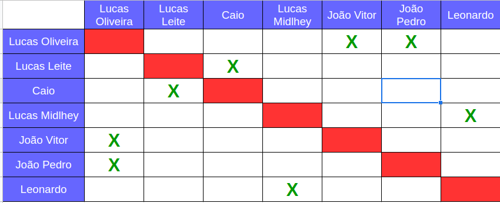
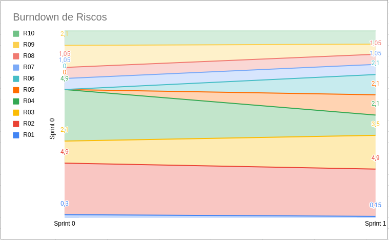

# Planejamento da Sprint 1

**Número da _Sprint_:** 1

**Data de Início:** 23/08/2021  

**Data de Término:** 30/08/2021

**Duração:** Sete dias

**Pontos Planejados**: 35

**Pontos Adicionados**: 0

**Pontos Totais**: 35

-------

[1. Pareamento](#1-pareamento)

[2. Priorização](#2-priorizacao)

[3. Burndown de Riscos](#4-burndown-de-riscos)

[4. Features da _Sprint_](#5-features-da-sprint)

-------
## 1. Pareamento

## 2. Mudanças
Nessa _Sprint_ o time decidiu por mudar o a tecnologia de comunicação do _Whatsapp_ para o Telegram. 

Também, foi decidido que as _dailies_ vão acontecer às quartas e sabádos via um _bot_ do telegram e às sextas por meio do _Teams_.

## 2. Priorização
A priorização das _features_ foi feita na necessidade de entregar valor para o cliente e as dívidas técnicas.

## 3. Burndown de Riscos

A  tabela a seguir lista todos os riscos que foram identificados para essa _Sprint_, a probabilidade deles ocorrerem, quantos dias serão perdidos caso o risco ocorra e a exposição ao risco. A probabilidade do risco é dividida em:
    * Nenhuma = 0%;
    * Muita baixa = 15%;
    * Baixa = 30%;
    * Média = 50%;
    * Alta = 70%;
    * Vai ocorrer = 100%.

Já a exposição é calculada multiplicando a probabilidade do risco pelo tamanho da perda.

| #  | Descrição | Probabilidade do Risco |Tamanho da Perda (dias)|Exposição ao Risco |
| :- | :---------------                                         | :---| :-| :--- |
| 01 | Incompatibilidade de horários para reuniões              | 15% | 1 | 0,15 |
| 02 | Features mal pontuadas                                   | 70% | 7 | 4,9  |
| 03 | Baixa produtividade                                      | 50% | 7 | 3,5  |
| 04 | Mais pontos planejados do que o time é capaz de entregar | 30% | 7 | 2,1  |
| 05 | Dificuldades com a tecnologia de desenvolvimento         | 70% | 3 | 2,1  |
| 06 | Erros na implementação de Features                       | 30% | 7 | 2,1  |
| 07 | Features mal documentadas                                | 15% | 7 | 1,05 |
| 08 | Quebra ou furto de equipamentos da equipe                | 15% | 7 | 1,05 |
| 09 | Desistência de algum membro                              | 15% | 7 | 1,05 |
| 10 | Problemas na configuração do ambiente de desenvolvimento | 70% | 2 | 1,4  |
|    |   |   | Exposição:  | 19,4 |

Abaixo é mostrado o _Burndown_ de riscos das _Sprints_ em que foi em que ele foi levantado.

## 4. Features da _Sprint_
* <a href="https://github.com/lucaaas/Equipe8DS/issues/23"> [#23]Eu, como desenvolvedor, gostaria de desenhar um diagrama de classes para orientar o desenvolvimento </a>
* <a href="https://github.com/lucaaas/Equipe8DS/issues/24"> [#24]Eu, como desenvolvedor, gostaria de configurar um ambiente de desenvolvimento para a execução do projeto </a>
* <a href="https://github.com/lucaaas/Equipe8DS/issues/7"> [#7]Eu, como jogador, gostaria de manter um personagem para poder interagir com o jogo. </a>
* <a href="https://github.com/lucaaas/Equipe8DS/issues/8"> [#8]Eu, como jogador, gostaria de manter uma conta para acessar o sistema </a>
* <a href="https://github.com/lucaaas/Equipe8DS/issues/11"> [#11]Eu, como mestre, gostaria de manter um item. </a>
* <a href="https://github.com/lucaaas/Equipe8DS/issues/21"> [#21]Eu, como mestre, gostaria de manter um NPC para interação com o jogo. </a>