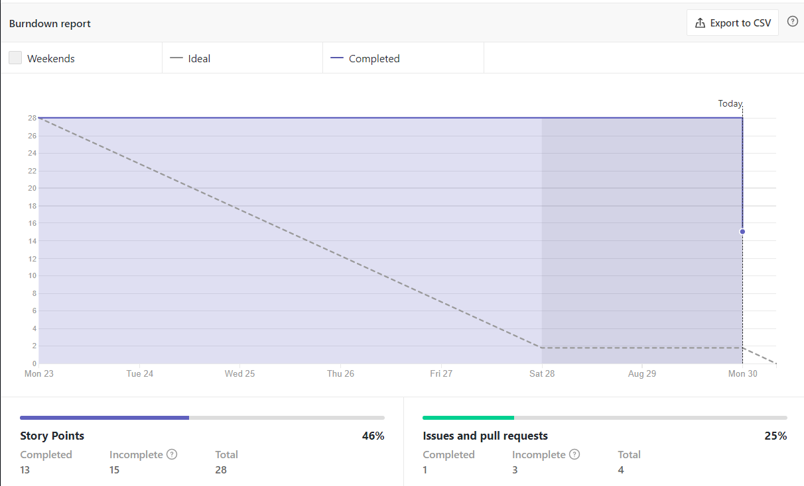
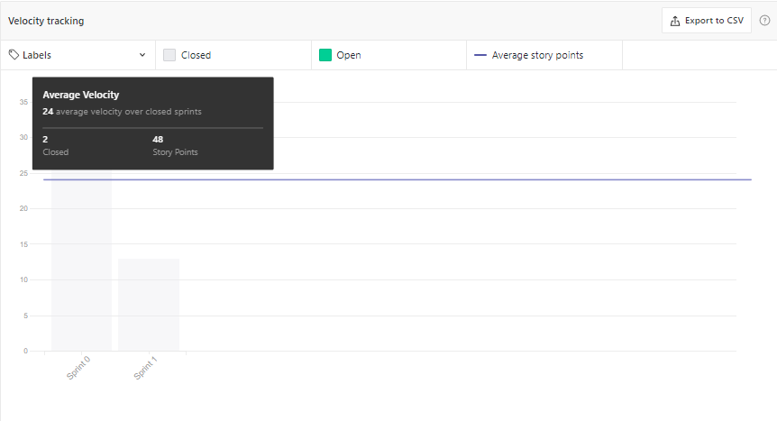
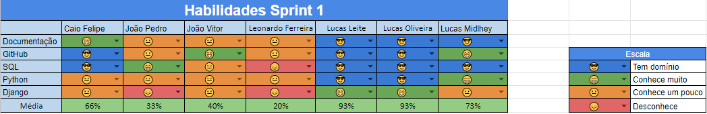

# Resultados da Sprint 1
------

[1. Indicadores de Qualidade do Processo](#1-indicadores-de-qualidade-do-processo)

- [# Resultados da Sprint 1](#-resultados-da-sprint-1)
- [1. Indicadores de Qualidade do Processo](#1-indicadores-de-qualidade-do-processo)
  - [1.1 Fechamento da _Sprint_](#11-fechamento-da-sprint)
  - [1.2 _Burndown_](#12-burndown)
  - [1.3 Gráfico de _commits_](#13-gráfico-de-commits)
  - [1.4 _Velocity_](#14-velocity)
  - [1.5 Quadro de Conhecimento](#15-quadro-de-conhecimento)
  - [1.6 Revisão da _Sprint_](#16-revisão-da-sprint)
  - [1.7 Retrospectiva](#17-retrospectiva)
  - [1.7.1 Pontos Positivos](#171-pontos-positivos)
  - [1.7.2 Pontos Negativos](#172-pontos-negativos)
  - [1.7.3 Melhorias](#173-melhorias)
  - [2. Análise do _Scrum Master_](#2-análise-do-scrum-master)

[2. Análise do _Scrum Master_](#2-análise-do-scrum-master)  

------

## 1. Indicadores de Qualidade do Processo

### 1.1 Fechamento da _Sprint_
| História | Pontos | Status |
| :------- | :----- | :----- |
<a href="https://github.com/lucaaas/Equipe8DS/issues/23"> [#23] Desenhar diagrama de classes </a> | 5 | Concluído |
<a href="https://github.com/lucaaas/Equipe8DS/issues/24"> [#24] Configurar ambiente </a> | 13 | Concluído |
<a href="https://github.com/lucaaas/Equipe8DS/issues/7"> [#7] Eu, como jogador, gostaria de manter um personagem para poder interagir com o jogo. </a> | 13 | Concluído |
<a href="https://github.com/lucaaas/Equipe8DS/issues/8"> [#8]Eu, como jogador, gostaria de manter uma conta para acessar o sistema </a> | 6 | Não concluído |
<a href="https://github.com/lucaaas/Equipe8DS/issues/11"> [#11]Eu, como mestre, gostaria de manter um item. </a> | 8 | Não concluído |
<a href="https://github.com/lucaaas/Equipe8DS/issues/21"> [#21]Eu, como mestre, gostaria de manter um NPC para interação com o jogo. </a> | 1 | Não concluído |

Dos 28 pontos planejados, 13 foram entregues, mais 18 pontos de dívida técnica.

### 1.2 _Burndown_

Nessa _Sprint_ o _Burndown_ não teve o comportamento ideal. Porém, por ser a primeira do time, isso já era esperado.

### 1.4 _Velocity_

O _velocity_ representa a média de pontos entregues por _Sprint_. Essa __sprint__ o __velocity__ aumentou de 17 para 24.

### 1.5 Quadro de Conhecimento

Pelo quadro atual de conhecimento percebe-se que uma parte do time possui um certo domínio da tecnologias que serão usadas e espera-se, por esse motivo e com o uso de pareamentos, que o conhecimento se torne mais homogênio.

### 1.6 Revisão da _Sprint_

O membro Lucas Leite teve problemas para levantar o ambiente, mas conseguiu corrigir.

### 1.7 Retrospectiva

### 1.7.1 Pontos Positivos

  - A equipe conseguiu entregar sua primeira história de usuário.
  - O time conseguiu migrar para o telegram sem problemas.
  - Houve percepção de melhoria do conhecimento.

### 1.7.2 Pontos Negativos

  - A equipe não fez daily.
  - Não foram entregues todos os pontos.
  - Falta de tempo e organização.

### 1.7.3 Melhorias

  - Procurar um bot de daily para o telegram.

### 2. Análise do _Scrum Master_

Por ser a primeira _Sprint_ da equipe e ser o primeiro projeto de uma parte signitiva desta, esperava-se que ocorressem problemas e é um bom sinal que tenha ocorrido.

Foi percebido que faltou iniciativa e participação por parte da maioria dos membros e, apesar de também ser esperado no início de um projeto, é importante tomar cuidado e incentivar a partição de todos.

Como SM, faltou cuidado em cobrar a execução das _dailies_ e isso é algo que não pode ocorrer novamente, sob risco de não cumprir o que foi planejado.