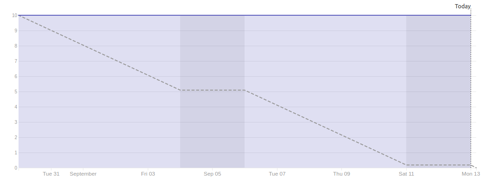
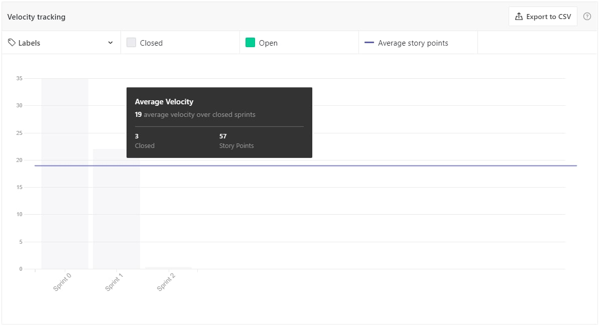
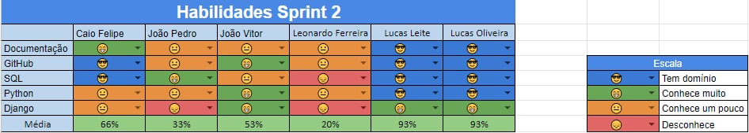
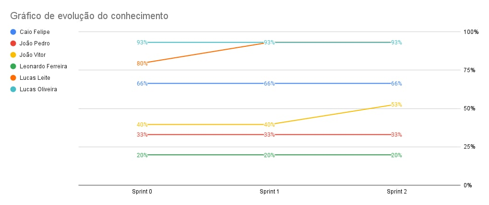

# Resultados da Sprint 2
------

[1. Indicadores de Qualidade do Processo](#1-indicadores-de-qualidade-do-processo)

- [# Resultados da Sprint 2](#-resultados-da-sprint-2)
- [1. Indicadores de Qualidade do Processo](#1-indicadores-de-qualidade-do-processo)
  - [1.1 Fechamento da _Sprint_](#11-fechamento-da-sprint)
  - [1.2 _Burndown_](#12-burndown)
  - [1.3 _Velocity_](#14-velocity)
  - [1.4 Quadro de Conhecimento](#15-quadro-de-conhecimento)
  - [1.5 Revisão da _Sprint_](#16-revisão-da-sprint)
  - [1.6 Retrospectiva](#17-retrospectiva)
  - [1.6.1 Pontos Positivos](#171-pontos-positivos)
  - [1.6.2 Pontos Negativos](#172-pontos-negativos)
  - [1.6.3 Melhorias](#173-melhorias)
  - [2. Análise do _Scrum Master_](#2-análise-do-scrum-master)

[2. Análise do _Scrum Master_](#2-análise-do-scrum-master)  

------

## 1. Indicadores de Qualidade do Processo

### 1.1 Fechamento da _Sprint_
| História | Pontos | Status |
| :------- | :----- | :----- |
<a href="https://github.com/lucaaas/Equipe8DS/issues/9">[#9] Eu, como mestre, gostaria de manter uma loja para permitir que os personagens possam comprar e vender itens  </a> | 3 | Não concluido|
<a href="https://github.com/lucaaas/Equipe8DS/issues/10"> [#10]Eu, como mestre, gostaria de manter a cidade para ter um controle melhor do jogo </a> | 7 | Não concluido|
<a href="https://github.com/lucaaas/Equipe8DS/issues/8"> [#8]Eu, como jogador, gostaria de manter uma conta para acessar o sistema </a> | 6 | Não concluído |
<a href="https://github.com/lucaaas/Equipe8DS/issues/11"> [#11]Eu, como mestre, gostaria de manter um item. </a> | 8 | Concluído |
<a href="https://github.com/lucaaas/Equipe8DS/issues/21"> [#21]Eu, como mestre, gostaria de manter um NPC para interação com o jogo. </a> | 1 | Concluído |

Dos 25 pontos planejados, 9 pontos de dívida técnica foram entregues.

### 1.2 _Burndown_

Nessa sprint concluimos as dívidas técnicas da sprint 1. Não sendo concluída nenhuma issue da sprint 2. 

### 1.3 _Velocity_

O _velocity_ representa a média de pontos entregues por _Sprint_. Essa __sprint__ o __velocity__ diminuiu de 24 para 19.

### 1.4 Quadro de Conhecimento

Pelo quadro atual de conhecimento percebe-se que uma parte do time avançou nos conhecimentos acerca da linguagem e do framework utilizado devido a pratica com as ferramentas, evolução essa perceptivel pelo gráfico:

### 1.5 Revisão da _Sprint_

A Sprint teve que ser prolongada por conta dos atrasos causados pelo feriado. Com seu encerramento ocorrendo somente dia 13/09. Nessa __sprint__ foram concluidas algumas das dívidas técnicas originadas da __sprint__ 1. Um dos membros do grupo teve que retirar a disciplina, acarretando numa menor velocidade de execução das issues, pois era um membro experiente no framework.

### 1.6 Retrospectiva

### 1.6.1 Pontos Positivos

  - A equipe conseguiu evoluir as habilidades no framework e na linguagem utilizada.
  - Houve percepção de melhoria do conhecimento.

### 1.6.2 Pontos Negativos

  - Saída de um dos membros do grupo.
  - Não foram entregues todos os pontos.
  - Falta de tempo e organização.
  - Burndown não teve entregas continuas

### 1.6.3 Melhorias

  - Procurar um bot de daily para o telegram.

### 2. Análise do _Scrum Master_

Nessa _sprint_ o SM falhou novamente em executar as dailies e é importante que o próximo não deixe esse erro ser propagado e para isso é importante encontrar uma boa alternativa por isso encontrar um bot que faça isso pode ajudar bastante.

Finalizando, nessa sprint tivemos alguns contra tempos que atrasaram a conclusão de algumas issues, deixando dívidas técnicas a serem concluídas na proxima sprint, isso se deve principalmente por causa da saída de um dos membros mais experientes do grupo e tambem por conta de um feriado no meio da semana.