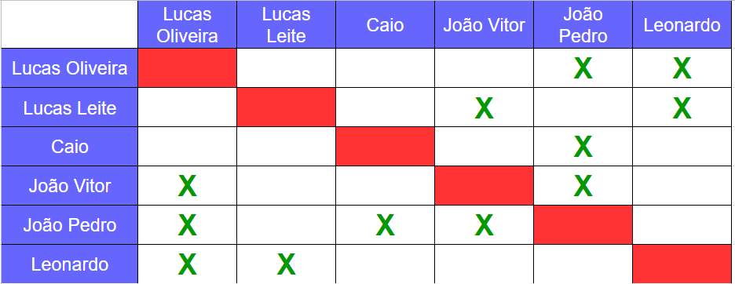
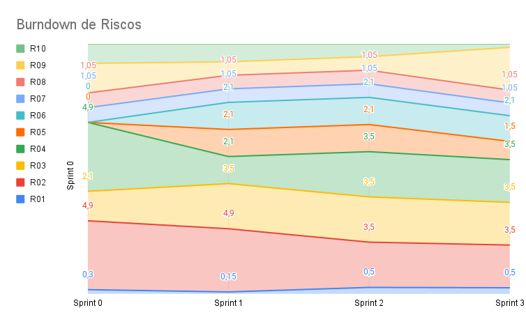

# Planejamento da Sprint 3

**Número da _Sprint_:** 3

**Data de Início:** 13/09/2021  

**Data de Término:** 20/09/2021

**Duração:** Sete dias

**Pontos Planejados**: 9

**Pontos Adicionados**: 16

**Pontos Totais**: 25

-------

[1. Pareamento](#1-pareamento)

[2. Mudanças](#2-mudanças)

[3. Priorização](#3-priorização)

[4. Burndown de Riscos](#4-burndown-de-riscos)

[5. Features da _Sprint_](#5-features-da-sprint)

-------
## 1. Pareamento

## 2. Mudanças
Nessa _Sprint_ o Houve uma alteração no Scrum Master. O Scrum Master dessa Sprint é o membro João Vitor de Souza Durço (180123459). O integrante da equipe Lucas Midhley deixou a disciplina.

## 3. Priorização
A priorização das _features_ foi feita na necessidade de entregar valor para o cliente e as dívidas técnicas.

## 4. Burndown de Riscos

A  tabela a seguir lista todos os riscos que foram identificados para essa _Sprint_, a probabilidade deles ocorrerem, quantos dias serão perdidos caso o risco ocorra e a exposição ao risco. A probabilidade do risco é dividida em:
    * Nenhuma = 0%;
    * Muita baixa = 15%;
    * Baixa = 30%;
    * Média = 50%;
    * Alta = 70%;
    * Vai ocorrer = 100%.

Já a exposição é calculada multiplicando a probabilidade do risco pelo tamanho da perda.

| #  | Descrição | Probabilidade do Risco |Tamanho da Perda (dias)|Exposição ao Risco |
| :- | :---------------                                         | :---| :-| :--- |
| 01 | Incompatibilidade de horários para reuniões              | 50% | 1 | 0,5 |
| 02 | Features mal pontuadas                                   | 50% | 7 | 3,5  |
| 03 | Baixa produtividade                                      | 50% | 7 | 3,5  |
| 04 | Mais pontos planejados do que o time é capaz de entregar | 50% | 7 | 3,5  |
| 05 | Dificuldades com a tecnologia de desenvolvimento         | 50% | 3 | 1,5  |
| 06 | Erros na implementação de Features                       | 30% | 7 | 2,1  |
| 07 | Features mal documentadas                                | 15% | 7 | 1,05 |
| 08 | Quebra ou furto de equipamentos da equipe                | 15% | 7 | 1,05 |
| 09 | Desistência de algum membro                              | 50% | 7 | 3,5 |
| 10 | Problemas na configuração do ambiente de desenvolvimento | 15% | 2 | 0,3  |
|    |   |   | Exposição:  | 20,5 |

Abaixo é mostrado o _Burndown_ de riscos das _Sprints_ em que foi em que ele foi levantado.

## 5. Features da _Sprint_
* <a href="https://github.com/lucaaas/Equipe8DS/issues/9">[#9] Eu, como mestre, gostaria de manter uma loja para permitir que os personagens possam comprar e vender itens  </a>
* <a href="https://github.com/lucaaas/Equipe8DS/issues/10"> [#10]Eu, como mestre, gostaria de manter a cidade para ter um controle melhor do jogo </a>
* <a href="https://github.com/lucaaas/Equipe8DS/issues/8"> [#8]Eu, como jogador, gostaria de manter uma conta para acessar o sistema </a>
* <a href="https://github.com/lucaaas/Equipe8DS/issues/15"> [#15]Eu, como personagem, gostaria de manter meu inventário para ter o controle sobre entrada e saída de itens e tesouro </a>
* <a href="https://github.com/lucaaas/Equipe8DS/issues/16"> [#16]Eu, como mestre, gostaria de adicionar e remover itens de uma loja para controlar o estoque das lojas </a>
* <a href="https://github.com/lucaaas/Equipe8DS/issues/37"> [#37]Eu, como desenvolvedor, gostaria de fazer deploy da aplicação para ter a API disponível para consumo </a>