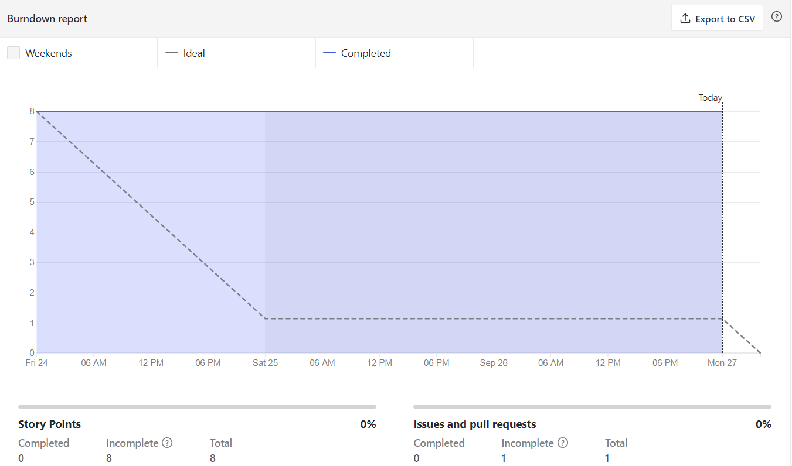
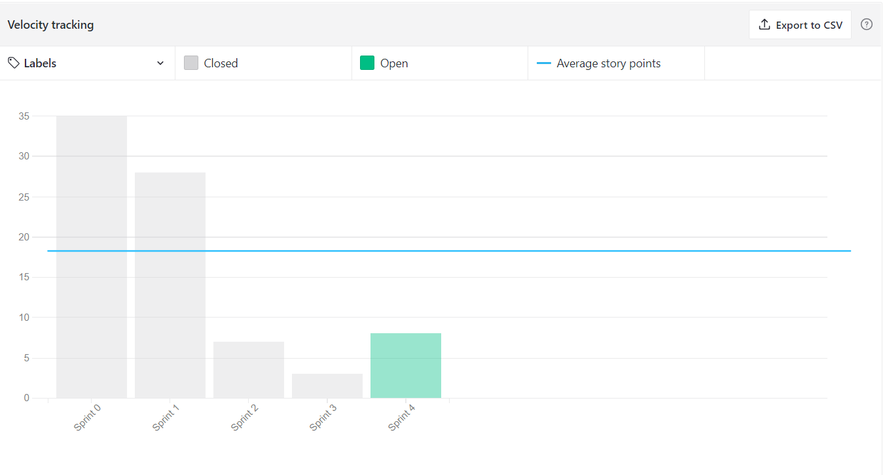
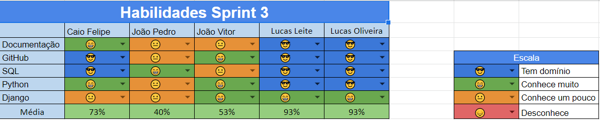
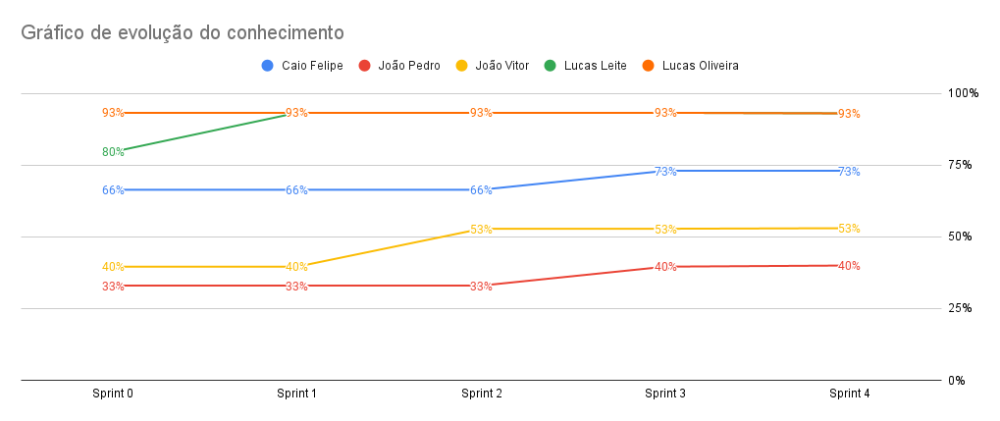

# Resultados da Sprint 4
------

[1. Indicadores de Qualidade do Processo](#1-indicadores-de-qualidade-do-processo)

- [# Resultados da Sprint 4](#-resultados-da-sprint-4)
- [1. Indicadores de Qualidade do Processo](#1-indicadores-de-qualidade-do-processo)
  - [1.1 Fechamento da _Sprint_](#11-fechamento-da-sprint)
  - [1.2 _Burndown_](#12-burndown)
  - [1.3 _Velocity_](#14-velocity)
  - [1.4 Quadro de Conhecimento](#15-quadro-de-conhecimento)
  - [1.5 Revisão da _Sprint_](#16-revisão-da-sprint)
  - [1.6 Retrospectiva](#17-retrospectiva)
  - [1.6.1 Pontos Positivos](#171-pontos-positivos)
  - [1.6.2 Pontos Negativos](#172-pontos-negativos)
  - [1.6.3 Melhorias](#173-melhorias)
  - [2. Análise do _Scrum Master_](#2-análise-do-scrum-master)

[2. Análise do _Scrum Master_](#2-análise-do-scrum-master)  

------

## 1. Indicadores de Qualidade do Processo

### 1.1 Fechamento da _Sprint_
| História | Pontos | Status |
| :------- | :----- | :----- |
<a href="https://github.com/lucaaas/Equipe8DS/issues/9">[#9] Eu, como mestre, gostaria de manter uma loja para permitir que os personagens possam comprar e vender itens  </a> | 3 | Não concluido|
<a href="https://github.com/lucaaas/Equipe8DS/issues/15"> [#15]Eu, como personagem, gostaria de manter meu inventário para ter o controle sobre entrada e saída de itens e tesouro </a> | 3 | Não concluído |
<a href="https://github.com/lucaaas/Equipe8DS/issues/16"> [#16]Eu, como mestre, gostaria de adicionar e remover itens de uma loja para controlar o estoque das lojas </a> | 3 | Não concluído |
<a href="https://github.com/lucaaas/Equipe8DS/issues/43"> [#43]Eu, como desenvolvedor, quero criar um bot do telegram que consuma a API Rest. </a> | 3 | Não concluído |

Dos 17 pontos planejados, 0 foram entregues.

### 1.2 _Burndown_

Nessa sprint não foi possível avançar no código do projeto.  

### 1.3 _Velocity_

O _velocity_ representa a média de pontos entregues por _Sprint_. Essa __sprint__ o __velocity__ diminuiu de 18,25 para 14,6.

### 1.4 Quadro de Conhecimento

Pelo quadro atual de conhecimento percebe-se houve uma estagnação nos conhecimentos da equipe acerca da linguagem e do framework utilizado devido à baixa produtividade da Sprint. Isto é perceptivel pelo gráfico:

### 1.5 Revisão da _Sprint_

A Sprint teve de ser encurtada, porque o Scrum Master confundiu a data de encerramento da Sprint passada. Nessa __sprint__, nenhuma _issue_ foi concluída, gerando dívida técnica para a próxima Sprint. Houve uma pequena dificuldade nos códigos desta Sprint, acarretando na estagnação do projeto. No entanto, os membros se preparam para concluir as tarefas na próxima. 

### 1.6 Retrospectiva

### 1.6.1 Pontos Positivos

  - Houve percepção de melhoria do conhecimento.
  - Dailies foram executadas.
  - _Bot_ já está funcionando parcialmente.

### 1.6.2 Pontos Negativos

  - A equipe não conseguiu evoluir as habilidades no framework e na linguagem utilizada.
  - Não foram entregues todos os pontos.
  - Falta de tempo e organização (Sprint mais curta).
  - Burndown não teve entregas continuas.

### 1.6.3 Melhorias

  - Finalizar sprint no dia planejado.

### 2. Análise do _Scrum Master_

Nessa _sprint_ o SM conseguiu prosseguir com a execução das dailies e é importante que os próximos se empenhem para que o erro não volte a acontecer.

Finalizando, nessa sprint tivemos alguns contra tempos que atrasaram a conclusão de algumas issues, deixando dívidas técnicas a serem concluídas na proxima sprint, isso se deve principalmente por causa da falta de conhecimento acerca da linguagem utilizada.