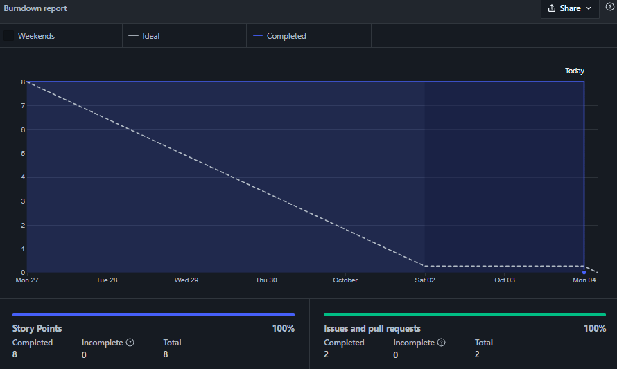

# Planejamento da Sprint 5

**Número da _Sprint_:** 5

**Data de Início:** 27/09/2021  

**Data de Término:** 04/10/2021

**Duração:** Sete dias

**Pontos Planejados**: 9

**Pontos Adicionados**: 8

**Pontos Totais**: 17

-------

[1. Pareamento](#1-pareamento)

[2. Mudanças](#2-mudanças)

[3. Priorização](#3-priorização)

[4. Burndown de Riscos](#4-burndown-de-riscos)

[5. Features da _Sprint_](#5-features-da-sprint)

-------
## 1. Pareamento

## 2. Mudanças
O Scrum Master dessa Sprint é o membro João Pedro Macedo Faria (211045169). A _feature_ nº 43 foi transformada em um novo épico.

## 3. Priorização
A priorização das _features_ foi mantida de acordo com a _Sprint_ anterior, mantendo a necessidade de entregar as dívidas técnicas e também evoluir a integração com o _Bot_.

## 4. Burndown de Riscos

A  tabela a seguir lista todos os riscos que foram identificados para essa _Sprint_, a probabilidade deles ocorrerem, quantos dias serão perdidos caso o risco ocorra e a exposição ao risco. A probabilidade do risco é dividida em:
    * Nenhuma = 0%;
    * Muita baixa = 15%;
    * Baixa = 30%;
    * Média = 50%;
    * Alta = 70%;
    * Vai ocorrer = 100%.

Já a exposição é calculada multiplicando a probabilidade do risco pelo tamanho da perda.

| #  | Descrição | Probabilidade do Risco |Tamanho da Perda (dias)|Exposição ao Risco |
| :- | :---------------                                         | :---| :-| :--- |
| 01 | Incompatibilidade de horários para reuniões              | 50% | 1 | 0,5 |
| 02 | Features mal pontuadas                                   | 30% | 7 | 2,1  |
| 03 | Baixa produtividade                                      | 50% | 7 | 3,5  |
| 04 | Mais pontos planejados do que o time é capaz de entregar | 50% | 7 | 3,5  |
| 05 | Dificuldades com a tecnologia de desenvolvimento         | 50% | 3 | 1,5  |
| 06 | Erros na implementação de Features                       | 30% | 7 | 2,1  |
| 07 | Features mal documentadas                                | 15% | 7 | 1,05 |
| 08 | Quebra ou furto de equipamentos da equipe                | 15% | 7 | 1,05 |
| 09 | Desistência de algum membro                              | 15% | 7 | 1,05 |
| 10 | Problemas na configuração do ambiente de desenvolvimento | 15% | 2 | 0,3  |
|    |   |   | Exposição:  | 16,65 |

Abaixo é mostrado o _Burndown_ de riscos das _Sprints_ em que foi em que ele foi levantado.

## 5. Features da _Sprint_
* <a href="https://github.com/lucaaas/Equipe8DS/issues/9">[#9] Eu, como mestre, gostaria de manter uma loja para permitir que os personagens possam comprar e vender itens  </a>
* <a href="https://github.com/lucaaas/Equipe8DS/issues/15"> [#15]Eu, como personagem, gostaria de manter meu inventário para ter o controle sobre entrada e saída de itens e tesouro </a>
* <a href="https://github.com/lucaaas/Equipe8DS/issues/16"> [#16]Eu, como mestre, gostaria de adicionar e remover itens de uma loja para controlar o estoque das lojas </a>
* <a href="https://github.com/lucaaas/Equipe8DS/issues/49"> [#49]Eu, como usuário, desejo visualizar os itens existentes para obter maiores informações sobre eles. </a>
* <a href="https://github.com/lucaaas/Equipe8DS/issues/51"> [#51]Eu, como usuário, desejo ver os dados da cidade para ter mais informações sobre elas. </a>