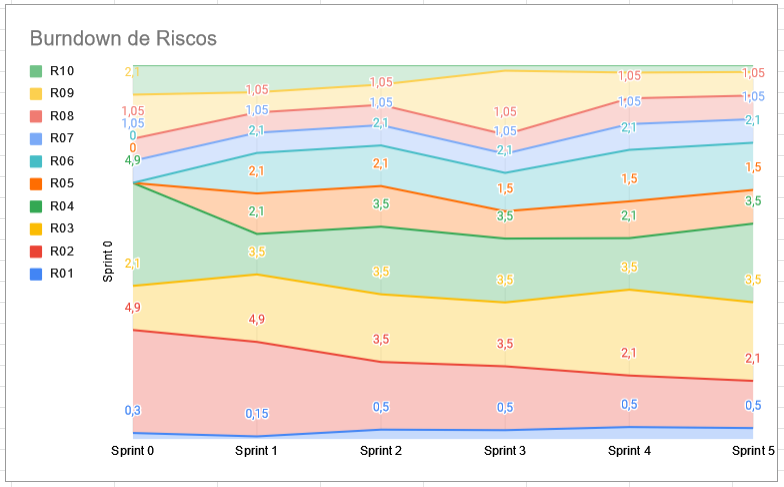
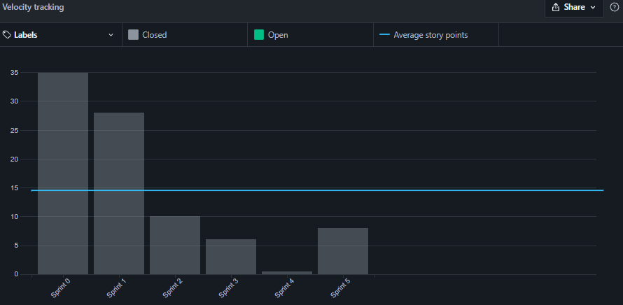
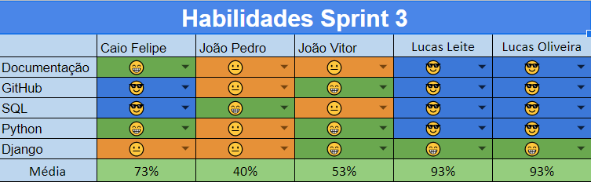
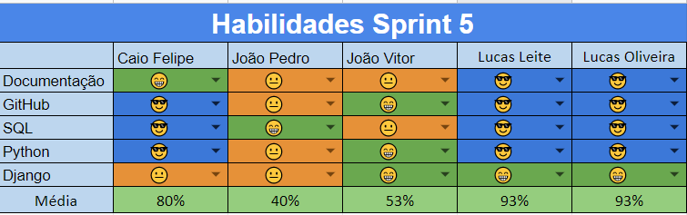

# Resultados da Sprint 5
------

[1. Indicadores de Qualidade do Processo](#1-indicadores-de-qualidade-do-processo)

- [# Resultados da Sprint 4](#-resultados-da-sprint-5)
- [1. Indicadores de Qualidade do Processo](#1-indicadores-de-qualidade-do-processo)
  - [1.1 Fechamento da _Sprint_](#11-fechamento-da-sprint)
  - [1.2 _Burndown_](#12-burndown)
  - [1.3 _Velocity_](#14-velocity)
  - [1.4 Quadro de Conhecimento](#15-quadro-de-conhecimento)
  - [1.5 Revisão da _Sprint_](#16-revisão-da-sprint)
  - [1.6 Retrospectiva](#17-retrospectiva)
  - [1.6.1 Pontos Positivos](#171-pontos-positivos)
  - [1.6.2 Pontos Negativos](#172-pontos-negativos)
  - [1.6.3 Melhorias](#173-melhorias)
  - [2. Análise do _Scrum Master_](#2-análise-do-scrum-master)

[2. Análise do _Scrum Master_](#2-análise-do-scrum-master)  

------

## 1. Indicadores de Qualidade do Processo

### 1.1 Fechamento da _Sprint_
| História | Pontos | Status |
| :------- | :----- | :----- |
<a href="https://github.com/lucaaas/Equipe8DS/issues/9">[#9] Eu, como mestre, gostaria de manter uma loja para permitir que os personagens possam comprar e vender itens  </a> |3| Concluído
<a href="https://github.com/lucaaas/Equipe8DS/issues/15"> [#15]Eu, como personagem, gostaria de manter meu inventário para ter o controle sobre entrada e saída de itens e tesouro </a> |3| Concluído
<a href="https://github.com/lucaaas/Equipe8DS/issues/16"> [#16]Eu, como mestre, gostaria de adicionar e remover itens de uma loja para controlar o estoque das lojas </a> |3| Concluído
<a href="https://github.com/lucaaas/Equipe8DS/issues/49"> [#49]Eu, como usuário, desejo visualizar os itens existentes para obter maiores informações sobre eles. </a> |5| Concluído
<a href="https://github.com/lucaaas/Equipe8DS/issues/51"> [#51]Eu, como usuário, desejo ver os dados da cidade para ter mais informações sobre elas. </a> |3| Concluído

Dos 17 pontos planejados, 0 foram entregues.

### 1.2 _Burndown_

### 1.3 _Velocity_

O _velocity_ representa a média de pontos entregues por _Sprint_. Essa __sprint__ o __velocity__ diminuiu 14,6 para 14,5.

### 1.4 Quadro de Conhecimento

O quadro de conhecimento da maior parte dos membros, não foi alterada, porém ao menos um dos membros tiveram melhora, conforme consta no quadro a seguir.

### 1.5 Revisão da _Sprint_

### 1.6 Retrospectiva

### 1.6.1 Pontos Positivos

  - Adicionada novas funcionalidades no _Bot_ do Telegram.
   
### 1.6.2 Pontos Negativos

  - Burndown não teve entregas contínuas.
  - Dailies não foram executadas.

### 1.6.3 Melhorias

  - Fazer daily.

### 2. Análise do _Scrum Master_

Apesar da equipe ter avançado nas histórias de dívida técnica, o _Scrum Master_ não conseguiu ajudar o grupo da forma como deveria.