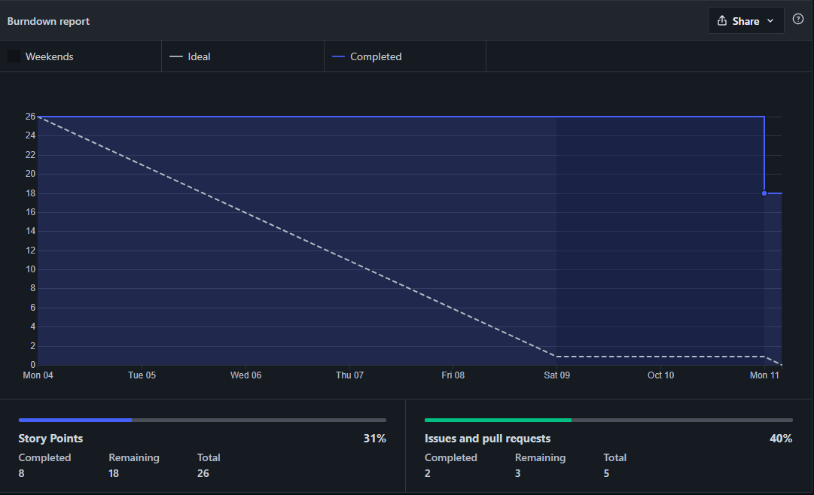
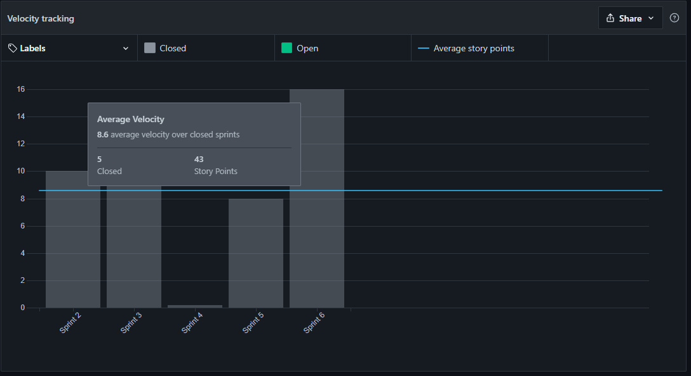
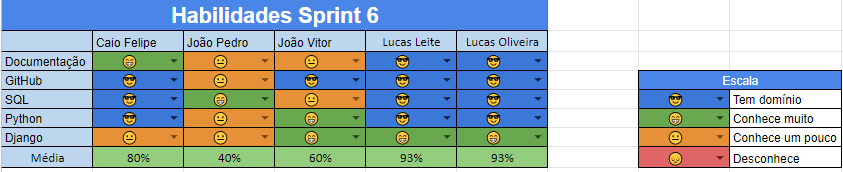
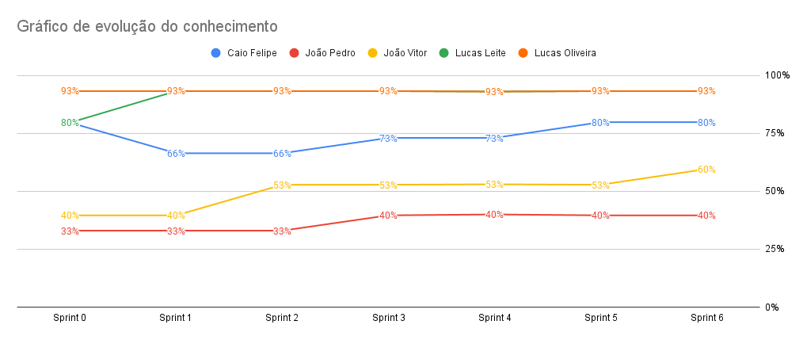

# Resultados da Sprint 7
------

[1. Indicadores de Qualidade do Processo](#1-indicadores-de-qualidade-do-processo)

- [# Resultados da Sprint 6](#-resultados-da-sprint-7)
- [1. Indicadores de Qualidade do Processo](#1-indicadores-de-qualidade-do-processo)
    - [1.1 Fechamento da _Sprint_](#11-fechamento-da-sprint)
    - [1.2 _Burndown_](#12-burndown)
    - [1.3 _Velocity_](#14-velocity)
    - [1.4 Quadro de Conhecimento](#15-quadro-de-conhecimento)
    - [1.5 Revisão da _Sprint_](#16-revisão-da-sprint)
    - [1.6 Retrospectiva](#17-retrospectiva)
    - [1.6.1 Pontos Positivos](#171-pontos-positivos)
    - [1.6.2 Pontos Negativos](#172-pontos-negativos)
    - [1.6.3 Melhorias](#173-melhorias)
    - [2. Análise do _Scrum Master_](#2-análise-do-scrum-master)

[2. Análise do _Scrum Master_](#2-análise-do-scrum-master)

------

## 1. Indicadores de Qualidade do Processo

### 1.1 Fechamento da _Sprint_
| História | Pontos | Status |
| :------- | :----- | :----- |
<a href="https://github.com/lucaaas/Equipe8DS/issues/14"> [#14]Eu, como personagem, gostaria de comprar um item em uma loja |8| Em andamento
<a href="https://github.com/lucaaas/Equipe8DS/issues/28"> [#28]Eu, como sistema, gostaria de manter o histórico do inventário de um personagem para controlar entrada e saída de itens. |5| Não concluído
<a href="https://github.com/lucaaas/Equipe8DS/issues/52"> [#52]Eu, como usuário, desejo ver os dados das lojas via bot existentes para saber quais estão disponíveis para interação. |5| Concluído
<a href="https://github.com/lucaaas/Equipe8DS/issues/53"> [#53]Eu, como usuário, desejo ver os dados dos jogadores via bot para saber mais informações sobre os participantes. |3| Concluído
<a href="https://github.com/lucaaas/Equipe8DS/issues/64"> [#64]Eu, como desenvolvedor, gostaria de manter o histórico de compras de uma loja para controlar entrada e saída de itens. |5| Não concluído

Dos 24 pontos planejados, 8 foram entregues.

### 1.2 _Burndown_

### 1.3 _Velocity_

O _velocity_ representa a média de pontos entregues por _Sprint_. Essa __sprint__ o __velocity__ diminuiu de 14,5 para 8,6.

### 1.4 Quadro de Conhecimento

O quadro de conhecimento da maior parte dos membros, não foi alterada, porém ao menos um dos membros tiveram melhora, conforme consta no quadro a seguir.

### 1.5 Revisão da _Sprint_

### 1.6 Retrospectiva

### 1.6.1 Pontos Positivos

- Adicionada novas funcionalidades no _Bot_ do Telegram.

### 1.6.2 Pontos Negativos

- Burndown não teve entregas contínuas.
- Dailies não foram executadas.

### 1.6.3 Melhorias

- Fazer daily.

### 2. Análise do _Scrum Master_