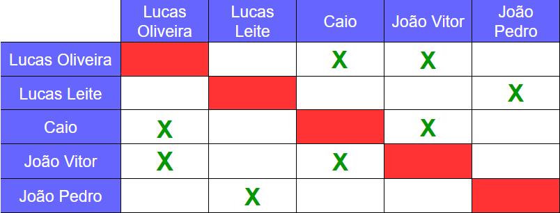
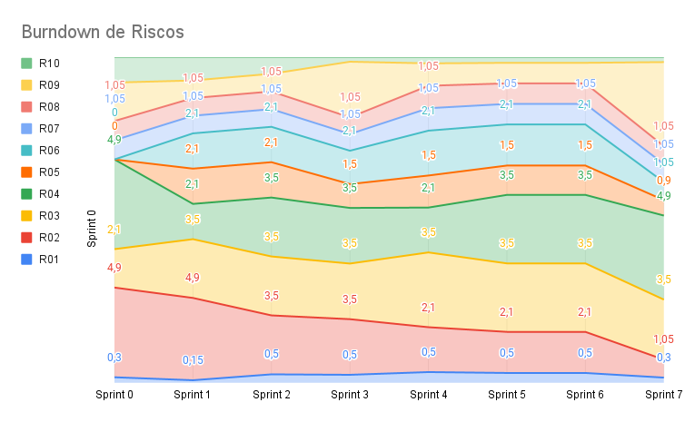

# Planejamento da Sprint 7

**Número da _Sprint_:** 7

**Data de Início:** 11/10/2021

**Data de Término:** 18/10/2021

**Duração:** Sete dias

**Pontos Planejados**: 29

**Pontos Adicionados**: 18

**Pontos Totais**: 47

-------

[1. Pareamento](#1-pareamento)

[2. Mudanças](#2-mudanças)

[3. Priorização](#3-priorização)

[4. Burndown de Riscos](#4-burndown-de-riscos)

[5. Features da _Sprint_](#5-features-da-sprint)

-------
## 1. Pareamento

## 2. Mudanças
Não houveram mudanças.

## 3. Priorização
A priorização das _features_ foi mantida de acordo com a _Sprint_ anterior, mantendo a necessidade de entregar as dívidas técnicas e também evoluir a integração com o _Bot_.

## 4. Burndown de Riscos

A  tabela a seguir lista todos os riscos que foram identificados para essa _Sprint_, a probabilidade deles ocorrerem, quantos dias serão perdidos caso o risco ocorra e a exposição ao risco. A probabilidade do risco é dividida em:
* Nenhuma = 0%;
* Muita baixa = 15%;
* Baixa = 30%;
* Média = 50%;
* Alta = 70%;
* Vai ocorrer = 100%.

Já a exposição é calculada multiplicando a probabilidade do risco pelo tamanho da perda.

| #  | Descrição | Probabilidade do Risco |Tamanho da Perda (dias)|Exposição ao Risco |
| :- | :---------------                                         | :---| :-| :--- |
| 01 | Incompatibilidade de horários para reuniões              | 30% | 1 | 0,3 |
| 02 | Features mal pontuadas                                   | 15% | 7 | 1,05  |
| 03 | Baixa produtividade                                      | 50% | 7 | 3,5  |
| 04 | Mais pontos planejados do que o time é capaz de entregar | 70% | 7 | 4,9 |
| 05 | Dificuldades com a tecnologia de desenvolvimento         | 30% | 3 | 0,9  |
| 06 | Erros na implementação de Features                       | 15% | 7 | 1,05  |
| 07 | Features mal documentadas                                | 15% | 7 | 1,05 |
| 08 | Quebra ou furto de equipamentos da equipe                | 15% | 7 | 1,05 |
| 09 | Desistência de algum membro                              | 70% | 7 | 4,9 |
| 10 | Problemas na configuração do ambiente de desenvolvimento | 15% | 2 | 0,3  |
|    |   |   | Exposição:  | 19 |

Abaixo é mostrado o _Burndown_ de riscos das _Sprints_ em que foi em que ele foi levantado.

## 5. Features da _Sprint_
* <a href="https://github.com/lucaaas/Equipe8DS/issues/14"> [#14]Eu, como personagem, gostaria de comprar um item em uma loja </a>
* <a href="https://github.com/lucaaas/Equipe8DS/issues/28"> [#28]Eu, como sistema, gostaria de manter o histórico do inventário de um personagem para controlar entrada e saída de itens. </a>
* <a href="https://github.com/lucaaas/Equipe8DS/issues/64"> [#64]Eu, como desenvolvedor, gostaria de manter o histórico de compras de uma loja para controlar entrada e saída de itens. </a>
* <a href="https://github.com/lucaaas/Equipe8DS/issues/18"> [#18]Eu, como desenvolvedor, gostaria de criar uma rotina de compras automáticas para manter a economia da cidade </a>
* <a href="https://github.com/lucaaas/Equipe8DS/issues/59"> [#59]Eu, como usuário, gostaria de visualizar o inventário de um personagem para saber quais itens ele possui.  </a>
* <a href="https://github.com/lucaaas/Equipe8DS/issues/65"> [#65]Eu, como usuário, gostaria de comprar um item via bot do telegram para facilitar o processo de compra. </a>

