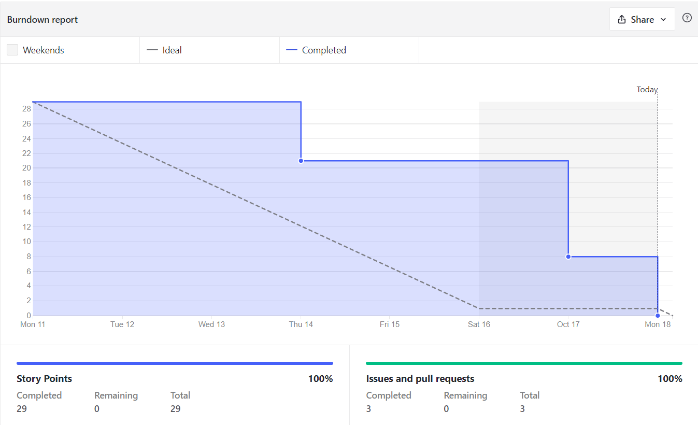
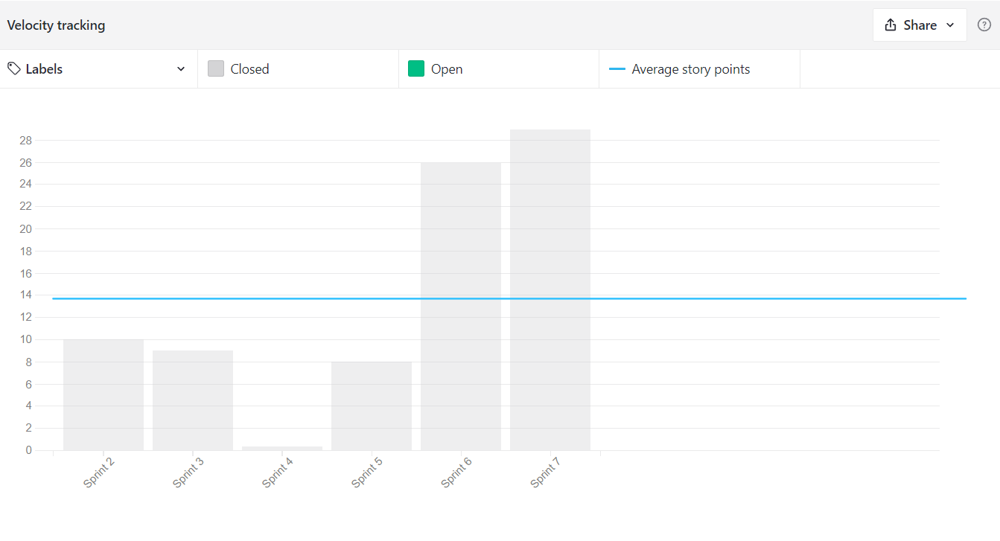
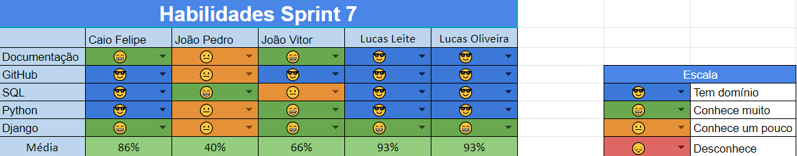
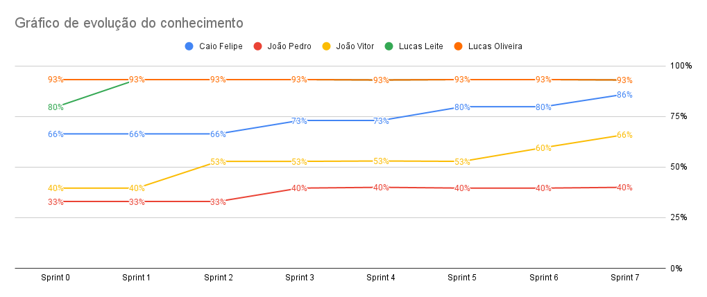

# Resultados da Sprint 6

---

[1. Indicadores de Qualidade do Processo](#1-indicadores-de-qualidade-do-processo)

- [# Resultados da Sprint 6](#-resultados-da-sprint-6)
- [1. Indicadores de Qualidade do Processo](#1-indicadores-de-qualidade-do-processo)
  - [1.1 Fechamento da _Sprint_](#11-fechamento-da-sprint)
  - [1.2 _Burndown_](#12-burndown)
  - [1.3 _Velocity_](#14-velocity)
  - [1.4 Quadro de Conhecimento](#15-quadro-de-conhecimento)
  - [1.5 Revisão da _Sprint_](#16-revisão-da-sprint)
  - [1.6 Retrospectiva](#17-retrospectiva)
  - [1.6.1 Pontos Positivos](#171-pontos-positivos)
  - [1.6.2 Pontos Negativos](#172-pontos-negativos)
  - [1.6.3 Melhorias](#173-melhorias)
  - [2. Análise do _Scrum Master_](#2-análise-do-scrum-master)

[2. Análise do _Scrum Master_](#2-análise-do-scrum-master)

---

## 1. Indicadores de Qualidade do Processo

### 1.1 Fechamento da _Sprint_

| História                                                                                                                                                                                | Pontos | Status    |
| :-------------------------------------------------------------------------------------------------------------------------------------------------------------------------------------- | :----- | :-------- |
| <a href="https://github.com/lucaaas/Equipe8DS/issues/14"> [#14]Eu, como personagem, gostaria de comprar um item em uma loja                                                             | 8      | Concluído |
| <a href="https://github.com/lucaaas/Equipe8DS/issues/28"> [#28]Eu, como sistema, gostaria de manter o histórico do inventário de um personagem para controlar entrada e saída de itens. | 5      | Concluído |
| <a href="https://github.com/lucaaas/Equipe8DS/issues/64"> [#64]Eu, como desenvolvedor, gostaria de manter o histórico de compras de uma loja para controlar entrada e saída de itens.   | 5      | Concluído |
| <a href="https://github.com/lucaaas/Equipe8DS/issues/18"> [#18]Eu, como desenvolvedor, gostaria de criar uma rotina de compras automáticas para manter a economia da cidade.            | 13     | Concluído |
| <a href="https://github.com/lucaaas/Equipe8DS/issues/59"> [#59]Eu, como usuário, gostaria de visualizar o inventário de um personagem para saber quais itens ele possui.                | 8      | Concluído |
| <a href="https://github.com/lucaaas/Equipe8DS/issues/65"> [#65]Eu, como usuário, gostaria de comprar um item via bot do telegram para facilitar o processo de compra.                   | 8      | Concluído |

Dos 47 pontos planejados, todos foram entregues.

### 1.2 _Burndown_

### 1.3 _Velocity_

O _velocity_ representa a média de pontos entregues por _Sprint_. Essa **sprint** o **velocity** aumentou de 8,6 para 13,67.

### 1.4 Quadro de Conhecimento

O quadro de conhecimento da maior parte dos membros, não foi alterada, porém ao menos um dos membros tiveram melhora, conforme consta no quadro a seguir.

### 1.5 Revisão da _Sprint_

Nessa **sprint**, todas as _issue_ foram concluídas, eliminando as dívidas técnicas das Sprints anteriores. Há um notável domínio das linguagens e os frameworks, acarretando no andamento acelerado do projeto. Agora, os membros se preparam para a entrega final do projeto.

### 1.6 Retrospectiva

### 1.6.1 Pontos Positivos

- Adicionada novas funcionalidades no _Bot_ do Telegram.
- Dailies voltaram a ser executadas.
- Todas as issues foram entregues.
- Bot possui uma interface mais amigável.
- Burndown teve entregas contínuas.

### 1.6.2 Pontos Negativos

- Há alguns bugs para serem corrigidos.
- Um integrante sumiu e o grupo não sabe o que está acontecendo.

### 1.6.3 Melhorias

- Continuar fazendo daily.

### 2. Análise do _Scrum Master_

Essa Sprint foi muito corrida, mas também foi muito bacana. Descobrimos algumas funções interessantes e conseguimos adicioná-las ao nosso Bot. Esperamos que tudo ocorra bem para a entrega do projeto final essa semana.
