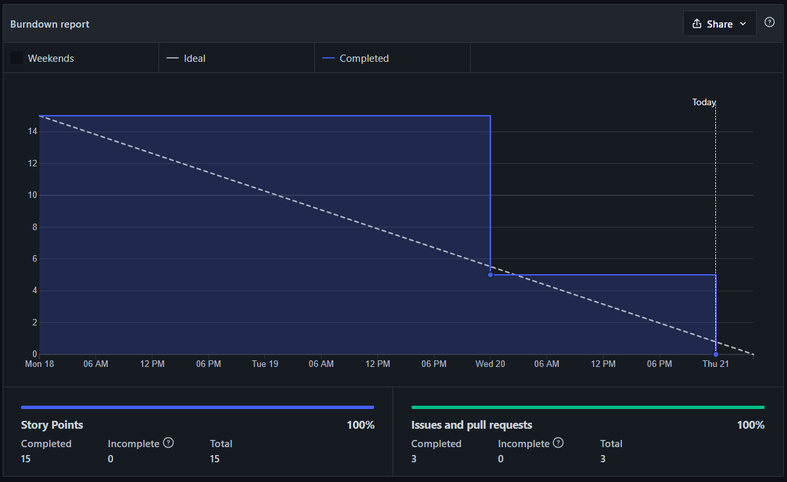

# Resultados da Sprint 8

---

[1. Indicadores de Qualidade do Processo](#1-indicadores-de-qualidade-do-processo)

- [# Resultados da Sprint 8](#-resultados-da-sprint-8)
- [1. Indicadores de Qualidade do Processo](#1-indicadores-de-qualidade-do-processo)
  - [1.1 Fechamento da _Sprint_](#11-fechamento-da-sprint)
  - [1.2 _Burndown_](#12-burndown)
  - [1.3 _Velocity_](#14-velocity)
  - [1.4 Quadro de Conhecimento](#15-quadro-de-conhecimento)
  - [1.5 Revisão da _Sprint_](#16-revisão-da-sprint)
  - [1.6 Retrospectiva](#17-retrospectiva)
  - [1.6.1 Pontos Positivos](#171-pontos-positivos)
  - [1.6.2 Pontos Negativos](#172-pontos-negativos)
  - [1.6.3 Melhorias](#173-melhorias)
  - [2. Análise do _Scrum Master_](#2-análise-do-scrum-master)

[2. Análise do _Scrum Master_](#2-análise-do-scrum-master)

---

## 1. Indicadores de Qualidade do Processo

### 1.1 Fechamento da _Sprint_

| História                                                                                                                                                                                | Pontos | Status    |
| :-------------------------------------------------------------------------------------------------------------------------------------------------------------------------------------- | :----- | :-------- |
| <a href="https://github.com/lucaaas/Equipe8DS/issues/54"> [#54]Eu, como desenvolvedor, gostaria de fazer deploy do bot do telegram para poder usá-lo de qualquer aparelho. </a>         | 8      | Concluído |
| <a href="https://github.com/lucaaas/Equipe8DS/issues/66"> [#66]Eu, como desenvolvedor, gostaria de fazer deploy do bot do telegram para poder usá-lo de qualquer aparelho. </a>         | 5      | Concluído |
| <a href="https://github.com/lucaaas/Equipe8DS/issues/75"> [#75]BugFix - Corrigir transferência de dinheiro pra loja </a>                                                                | 2      | Concluído |
| <a href="https://github.com/lucaaas/Equipe8DS/issues/77"> [#77]Eu, como usuário, gostaria de realizar login pelo bot </a>                                                               | 5      | Concluído |

Dos 20 pontos planejados, todos foram entregues.

### 1.2 _Burndown_

### 1.3 _Velocity_

O _velocity_ representa a média de pontos entregues por _Sprint_. Essa **sprint** o **velocity** aumentou de 13,67 para 14.57.

### 1.4 Quadro de Conhecimento

O quadro de conhecimento se manteve estável essa _Sprint_.

### 1.5 Revisão da _Sprint_

  Nessa _Sprint_ não houveram problemas.

### 1.6 Retrospectiva

### 1.6.1 Pontos Positivos

- Adicionada e melhoradas funcionalidades no _Bot_ do Telegram.
- Todas as issues foram entregues.
- Bot possui uma interface mais amigável.

### 1.6.2 Pontos Negativos

- Um integrante sumiu e o grupo não sabe o que está acontecendo.

### 1.6.3 Melhorias

- Não há melhorias a serem feitas

### 2. Análise do _Scrum Master_

- Essa _Sprint_ foi uma das mais corridas. O pessoal se dedicou bastante para fazer uma entrega bacana para o professor. Ademais, acredito que se tivessemos mais um pouquinho de tempo, poderíamos ter feito um _bot_ impecável! Parabenizo o time pelo semestre.